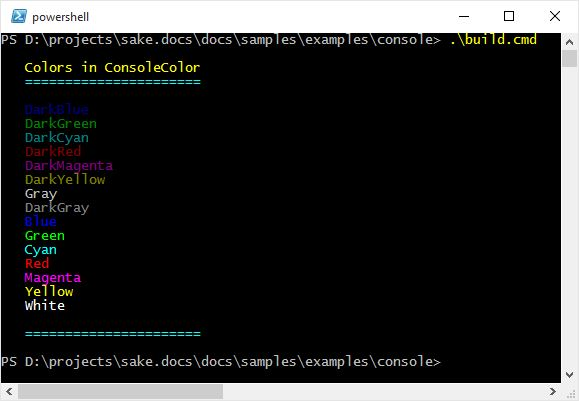

.. _console-example:

Console Example
===============

This example shows custom functions used to write to the Console in different colors.

``build.cmd``:

.. literalinclude:: ../../samples/examples/console/build.cmd
		:language: bat

``Console.shade`` saved to the ``imports`` directory:

.. literalinclude:: ../../samples/examples/console/imports/Console.shade
		:language: c#

``makefile.shade``:

.. literalinclude:: ../../samples/examples/console/makefile.shade
		:language: c#

Output:

