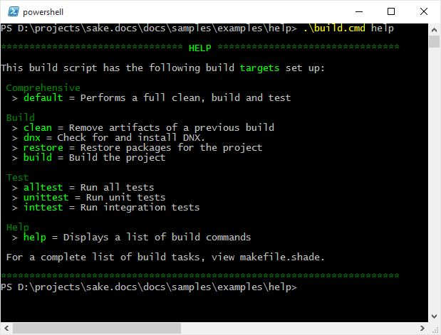

Help Example
============

This example shows custom functions and classes used to enumerate the targets in the build and list them in the console.  Targets have a ``description`` attribute, and this example allows for a group to be included in the description, separated from the actual target description using a ``|`` character.  This example makes use of the :ref:`console-example` to output text in color; include ``Console.shade`` in the ``imports`` folder if you aren't using the source code from `github`_.

.. _`github`: https://github.com/jeffogata/sake-docs/tree/master/docs/samples

``build.cmd``:

.. literalinclude:: ../../samples/examples/help/build.cmd
		:language: bat

``Help.shade`` saved to the ``imports`` directory:

.. literalinclude:: ../../samples/examples/help/imports/Help.shade
		:language: c#

``makefile.shade``:

.. literalinclude:: ../../samples/examples/help/makefile.shade
		:language: c#

Output:

