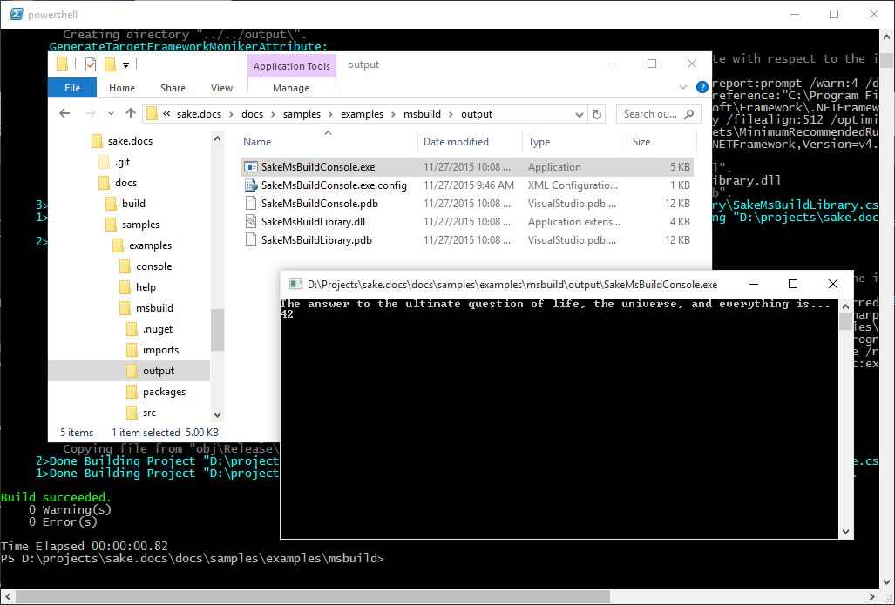

MSBuild Example
===============

The ``_build`` element that `comes with Sake`_ is written to use MSBuild 4.0.  If your source code uses features of C# 5 or 6, this may not work.  For example, when building an application that uses string interpolation, which was added in C# 6, the build fails indicating that ``$`` is an unexpected character.

This example shows a custom element, based on ``_build``, which uses MSBuild 14.0 (VS 2015, C# 6) or MSBuild 12.0 (VS 2012/13, C# 5).

The solution that this example builds can be found along with the other files on github_.  Note in the example ``makefile.shade``, the output directory is relative the ``.csproj`` files.

.. _`comes with Sake`: https://github.com/sakeproject/sake/blob/master/src/Sake.Library/Shared/_build.shade 
.. _github: https://github.com/jeffogata/sake-docs/tree/master/docs/samples/examples/msbuild

``build.cmd``:

.. literalinclude:: ../../samples/examples/msbuild/build.cmd
		:language: bat

``_msbuild.shade`` saved to the ``imports`` directory:

.. literalinclude:: ../../samples/examples/msbuild/imports/_msbuild.shade
		:language: c#

``makefile.shade``:

.. literalinclude:: ../../samples/examples/msbuild/makefile.shade
		:language: c#

Output:

